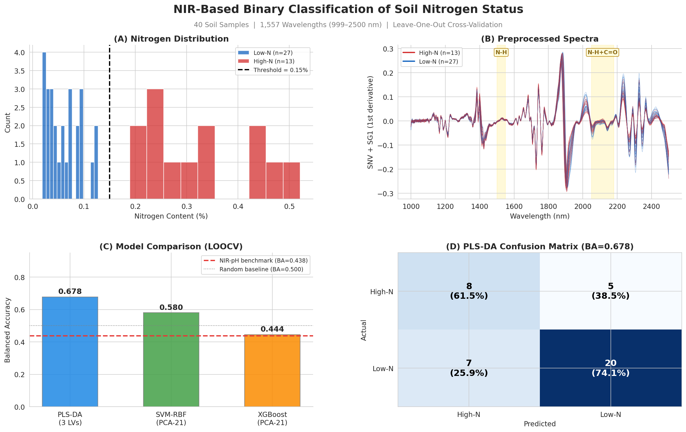

# Binary Classification of Soil Nitrogen Content from NIR Spectra of Agricultural Soils in Aceh, Indonesia 🇮🇩


## Summary

This repository implements an end-to-end binary classification pipeline for predicting soil nitrogen status (Low-N vs. High-N) from Near-Infrared (NIR) reflectance spectra. Forty agricultural soil samples from Aceh Province, Indonesia, each characterized by 1,557 spectral wavelengths (999--2500 nm), are classified using three model families: Partial Least Squares Discriminant Analysis (PLS-DA), Extreme Gradient Boosting (XGBoost), and Support Vector Machines with Radial Basis Function kernels (SVM-RBF). All models are evaluated under Leave-One-Out Cross-Validation (LOOCV) to maximize training data utilization given the small sample size.

Nitrogen is a particularly suitable target for NIR-based prediction because organic nitrogen exists primarily as N-H bonds in amino acids, proteins, and humic substances. These bonds produce direct, strong absorption features at 1500--1550 nm and 2050--2180 nm, providing a first-order spectroscopic basis for classification.

**Key Result:** PLS-DA achieves the highest balanced accuracy of **0.678** using only 3 latent variables, confirming that nitrogen classification from NIR spectra is feasible when the target variable has a direct spectroscopic basis.


## Graphical Abstract

<p align="center">
  
</p>
<p align="left"><em><strong>Figure. </strong> Four-panel graphical abstract summarizing the NIR-based binary classification pipeline for soil nitrogen status. <strong>(A)</strong> Distribution of total nitrogen content across 40 soil samples from Aceh Province, Indonesia, with the 0.15% agronomic threshold separating Low-N (n=27) and High-N (n=13) classes. <strong>(B)</strong> Preprocessed near-infrared reflectance spectra (SNV + Savitzky-Golay first derivative) colored by class, with highlighted N-H absorption bands at 1500-1550 nm and 2050-2180 nm that provide the direct spectroscopic basis for classification. <strong>(C)</strong> Balanced accuracy comparison across three models evaluated under Leave-One-Out Cross-Validation, with reference lines indicating the NIR-pH literature benchmark (BA = 0.438) and random baseline (BA = 0.500). PLS-DA achieves the highest balanced accuracy of 0.678 using three latent variables. <strong>(D)</strong> Confusion matrix for the best-performing PLS-DA model, showing per-class recall of 61.5% for High-N and 74.1% for Low-N. Dataset from Munawar et al. (2020); 1,557 wavelengths spanning 999 to 2500 nm.</em></p>


## Dataset

The dataset originates from [Munawar et al. (2020)](https://doi.org/10.17632/h8mht3jsbz.1), published on Mendeley Data.

| Property | Value |
| :--- | :--- |
| **Source** | Mendeley Data (DOI: 10.17632/h8mht3jsbz.1) |
| **Region** | Aceh Province, Indonesia |
| **Samples** | 40 agricultural soils |
| **Spectral range** | 999--2500 nm (1,557 wavelengths) |
| **Target variable** | Total nitrogen content (%) |
| **Classification** | Binary: Low-N (< 0.15%) vs. High-N (>= 0.15%) |
| **Class distribution** | Low-N: n=27 (67.5%), High-N: n=13 (32.5%) |
| **Threshold basis** | Agronomic convention for tropical soils (Masto et al., 2008) |

### Binary Threshold Rationale

The 0.15% total nitrogen boundary is a conventional cutoff in tropical soil fertility assessment. A boundary gap analysis confirms the threshold falls in a natural break in the data:

| Threshold | Low-N | High-N | Boundary Gap | Assessment |
| :---: | :---: | :---: | :---: | :--- |
| 0.10% | 24 | 16 | 0.020% | Tight: splits a dense cluster |
| **0.15%** | **27** | **13** | **0.062%** | **Clean: natural data gap** |
| 0.20% | 29 | 11 | 0.051% | Moderate gap, more imbalanced |

## Methods

### Preprocessing

Two parallel preprocessing paths are employed:

| Path | Transforms | Output Dimensions | Used By |
| :---: | :--- | :---: | :--- |
| **A** | Standard Normal Variate (SNV) + Savitzky-Golay 1st derivative | 1,557 features | PLS-DA |
| **B** | StandardScaler + PCA (21 components, 95.2% variance) | 21 features | XGBoost, SVM-RBF |

* **SNV** removes multiplicative scatter effects caused by particle size variation
* **SG1** (window=15, polyorder=2) removes baseline drift and enhances absorption peak resolution
* **PCA** reduces the 1,557-dimensional spectral space for tree-based and kernel methods

### Classification Models

| Model | Input | Hyperparameters | Tuning Strategy |
| :--- | :--- | :--- | :--- |
| **PLS-DA** | Path A (1,557 features) | n_components: 2--15 | LOOCV sweep |
| **XGBoost** | Path B (21 PCA scores) | max_depth=3, lr=0.05, subsample=0.7 | Fixed (regularized) |
| **SVM-RBF** | Path B (21 PCA scores) | C: {0.01--100}, gamma: {scale, 0.001--1} | Nested CV (LOO outer, StratKFold-5 inner) |

### Evaluation Protocol

* **Leave-One-Out Cross-Validation (LOOCV):** Each of the 40 samples is held out exactly once. Training on 39/40 samples (97.5%) per fold.
* **Nested CV (SVM-RBF):** Outer LOO (40 folds) x inner StratifiedKFold-5 = 5,000 SVM fits.
* **Primary metric:** Balanced Accuracy (mean of per-class recalls), robust to class imbalance.
* **Secondary metric:** F1-macro (unweighted mean of per-class F1 scores).


## Results

### Model Comparison

| Rank | Model | Balanced Accuracy | F1-macro | High-N Recall | Low-N Recall |
| :---: | :--- | :---: | :---: | :---: | :---: |
| 1 | **PLS-DA (3 LVs)** | **0.678** | **0.670** | **0.615** | **0.741** |
| 2 | SVM-RBF (PCA-21) | 0.580 | 0.580 | 0.308 | 0.852 |
| 3 | XGBoost (PCA-21) | 0.560 | 0.551 | 0.231 | 0.889 |

* All models exceed the NIR-pH literature benchmark (BA \~0.44), confirming nitrogen's stronger spectral signal.
* PLS-DA dominates due to supervised latent variable extraction on the full 1,557-wavelength spectrum.
* High-N minority class recall is the universal bottleneck (n=13 training samples per fold).

### Chronic Misclassifications

Four samples (18, 24, 25, 31) were misclassified by all three models:
* **Boundary cases:** Samples 24 and 31 sit at N=0.189%, just 0.039% above threshold
* **Spectral anomalies:** Samples 18 and 25 have atypical soil chemistry (extreme P, K, or pH) that distorts spectral signatures


## Requirements

```
python>=3.10
numpy>=1.24
pandas>=2.0
scikit-learn>=1.3
xgboost>=2.0
shap>=0.44
matplotlib>=3.7
seaborn>=0.12
scipy>=1.11
openpyxl>=3.1
```


## License

This project is licensed under the MIT License. 


## Questions?
For questions, suggestions, or collaboration, please open an issue in this repository or contact me at jprmaulion[at]gmail[dot]com. Cheers!
